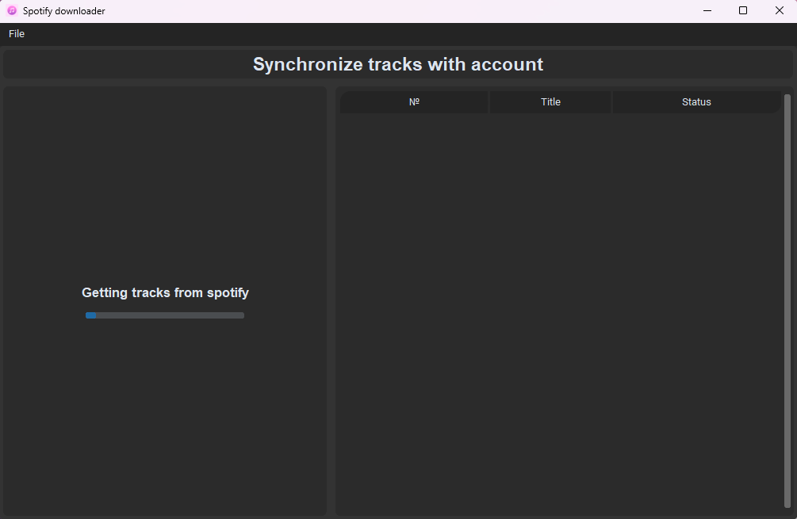

<h1 align="center">

  
Spotify-downloader

</h1>

Spotify-downloader is an application that allows you to download music from Spotify,
and also synchronize a local folder with tracks with your favorite tracks on Spotify.

## Features :sparkles:

* Synchronization of local and favorite tracks
    * You can download only missing tracks on the disk
    * You can check which tracks were accidentally removed from favorites
    * You can add tracks to ignore lists to skip them during synchronization
* Download tracks from playlists
* Download individual tracks by link
* Customizable number of download threads
* Automatic renaming of tracks during synchronization if they have been renamed in Spotify
* Automatic update

## Screenshots :camera:

|  |  |
|:------------------------:|:--------------------------------:|
|  |        |

## Installation :wrench:

1. Download the program from the [releases](https://github.com/LuTiFlekSSer/Spotify-downloader/releases/latest) section
2. Run the downloaded file
3. For synchronization with your account, you need to enter `client id`, `client secret`, and `redirect uri`, which you can get on the [developer page](https://developer.spotify.com/) of Spotify:
    1. Log in to the site with your Spotify account
    2. Go to the [Dashboard](https://developer.spotify.com/dashboard/) section
    3. [Create](https://developer.spotify.com/dashboard/create) a new application and fill in the fields
    4. Go to the page of the created application and click **settings**, where you can copy the necessary data
4. In the program, go to `Sync tracks` or `Checks tracks`
5. Follow the further instructions of the program to complete logging into your account

P.S. If you don't perform the actions from steps 3 and beyond, only downloading playlists and individual tracks will work

## Feedback :mailbox:

* If you encounter any issues with the program, you can create an [issue](https://github.com/LuTiFlekSSer/Spotify-downloader/issues/) with a description of the error and the `bug` label
* Suggestions for improvements can be made in [issue](https://github.com/LuTiFlekSSer/Spotify-downloader/issues/) with the `enhancement` label

___

